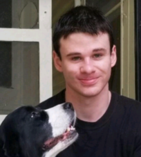

Hi, I'm Sam, a composer and creative technologist. This website contains my musical compositions, graphics projects, visualizations and other work. I'm a senior at Tulane University, majoring in Music and Computer Science with a minor in Music Science and Technology.

I am excited by areas in which sound and visual art overlap, and whether or not these connections are meaningful or arbitrary. Some of my interests are computer graphics, data visualization and sonification, physically based animation and sound, and digital signal processing.

