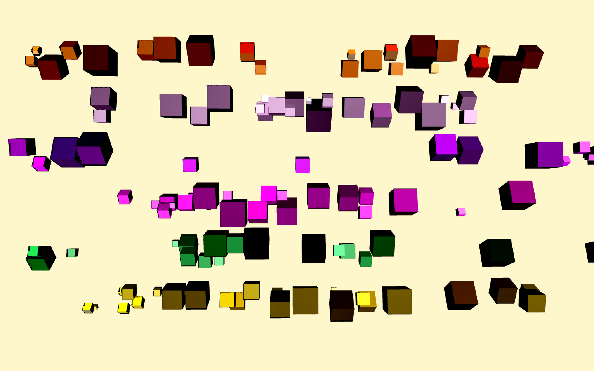
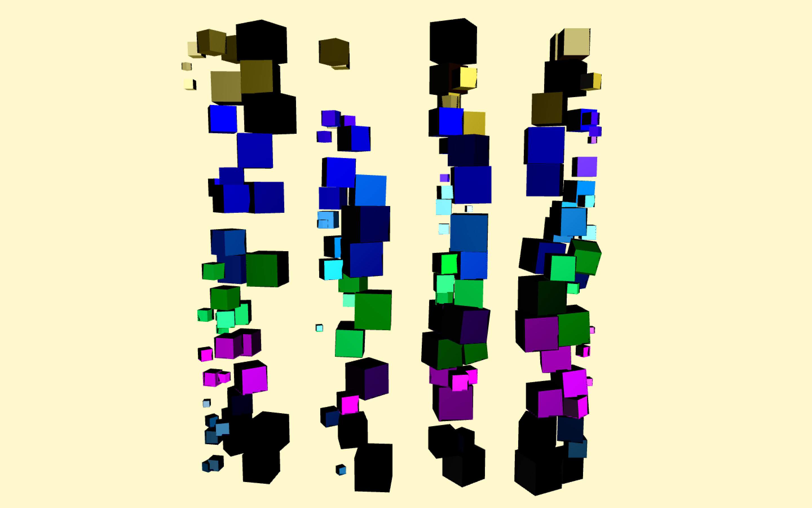

#### Handchimes
Handchimes is a rigid body simulation and digital instrument created with
Max/MSP. Collisions of rigid bodies are guided by a LeapMotion tracking device to create
sound. Audio is then routed through Ableton.
In Jitter, up to 72 cubes are created, each with its own unique physics constraint. Each
cube is placed on a barslide with a variable limit of motion. As a result, each cube can be moved
along a single axis in space. The collision strength of each cube (either with another cube or the
LeapMotion device) can be measured as impulse. The impulse of each collision is used to
generate a corresponding envelope for each pitch. Harder collisions last longer.
FM synthesis was used to play back the pitches of each collision. Different scenes are
created by varying FM index, the pitch space, as well as controlling the methods, grouping and
density of collisions. The LeapMotion device gives expressive control over which collisions
occur in a given scene. The result is an organic and varied music instrument.

#### Pitch space
Pitches are created according to the harmonic series. Each cube of each row of the barslide
lattice gets a unique pitch. Each row has 12 pitches. The lowest row has pitches 0-11, the next
12-23 and so on. The harmonic series is stretched at several points throughout the performance
to create variations in the tuning system. The pitch set is also varied by offsetting the set by an
octave or offsetting the global pitch by a given number of semitones. Any change in pitch space is accompanied with a change in color for all cubes.
Each row has its own EQ band.

Video coming soon. In the meantime here is an audio recording
<iframe width="100%" height="265" src="https://clyp.it/4vv2hfqq/widget" frameborder="0"></iframe>

