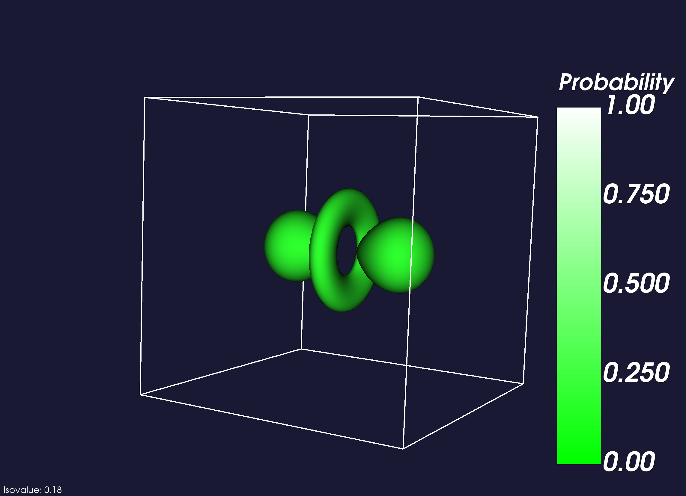

VTK project that creates an isosurface using marching cubes.
Below is a visulalization of a probability density function for a hydrogen atom.

Also included in this project is a volume renderer for a brain dataset.

<iframe src="https://streamable.com/s/vfyjq/nczo" frameborder="0" width="100%" height="100%" allowfullscreen style="width: 100%; height: 100%; position: absolute;"></iframe>

View the [code](http://github.com/sambeebe/isosurface-and-volume-rendering "Example") on GitHub.
