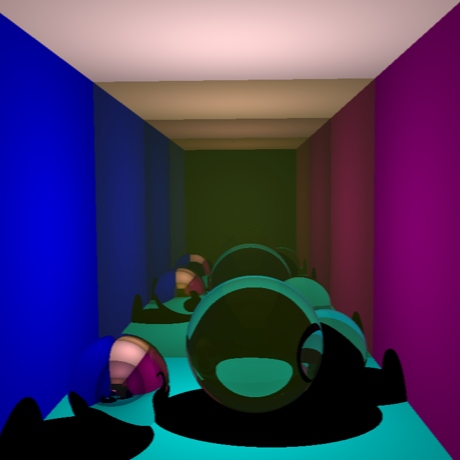

##### raytracer

A simple raytracer. Features an OpenGL preview scene. Press 'R' to raytrace or
press 'J' to raytrace with jittered anti-aliasing. This paper uses Turner Whitted's classic raytracing algorithm.

View the [code](http://github.com/sambeebe/whitted-style-raytracer "code") on GitHub.
