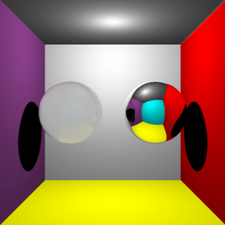

##### raytracer

A simple Whitted-style raytracer. Features an OpenGL preview scene. Press 'R' to raytrace or
press 'J' to raytrace with jittered anti-aliasing.

View the [code](http://github.com/sambeebe/whitted-style-raytracer "code") on GitHub.
