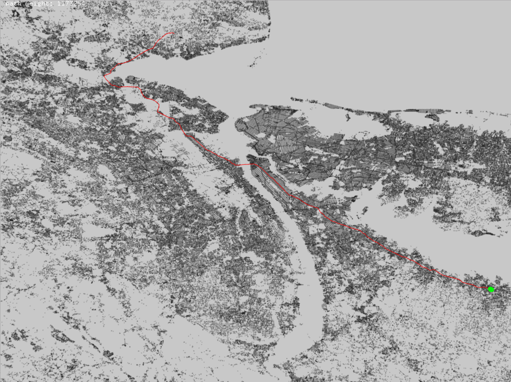

9th DIMACS Implementation Challenge - Shortest Paths

Computes and visualizes the shortest path for a DIMACS style graph (road network representing physical distance). Points are given as latitude and longitude and rendered as points, and Dijikstra's algorithm is used to compute the shortest path.

View the [code](http://github.com/sambeebe/whitted-style-raytracer "Example") on GitHub.
