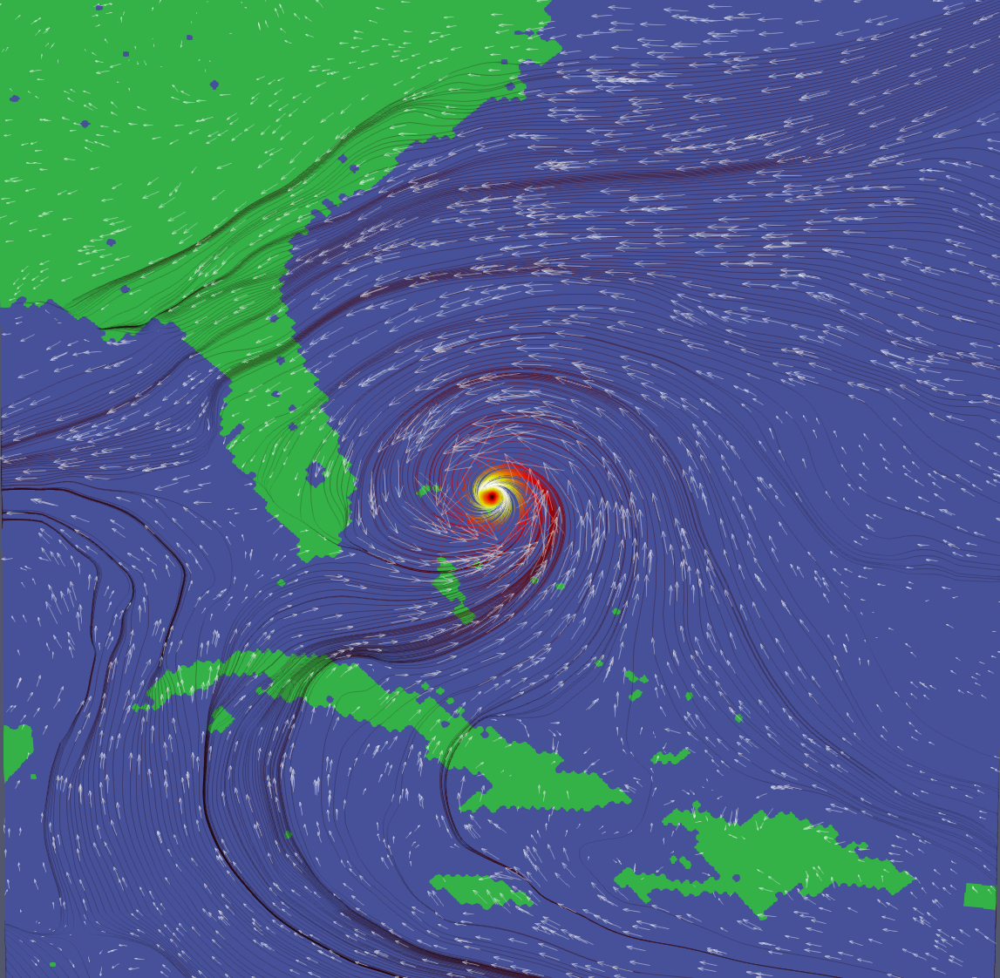
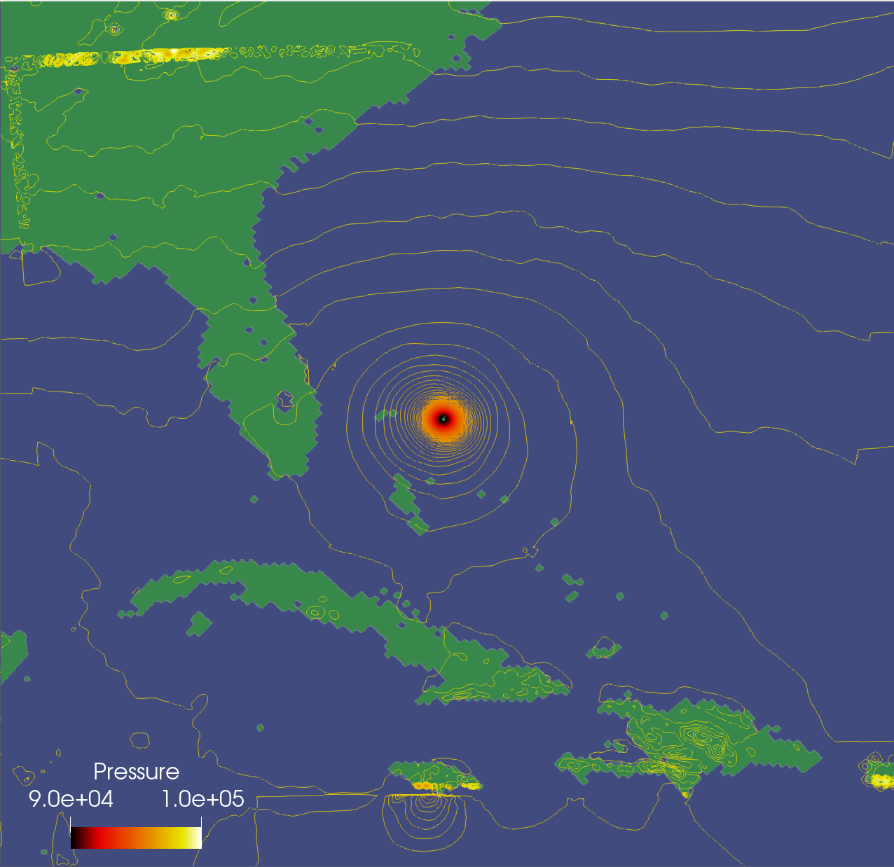

A visualization of a vector field representing Hurricane Dorian made in Paraview. To represent the wind velocity, I combined streamlines and
glyphs. For glyphs I choose 2d arrows which were scaled by magnitude and resized so that the fit the area of the screen without overlapping (note- for future improvements they should be scaled down even more).
For the vector field representing the wind magnitude, I reduced the maximum number of sampled points to 2000 in order to reduce clutter while preserving the overall trend. I think this was a nice number because you can see the field direction for each area as well as the inward curl of the hurricane. The opacities for each data set were fine tuned so that no information is occluded for the viewer.

To visualize pressure, I used a contour filter and added 100 steps in the value range [90007.1,104231]. These isocontours provide a complete overview of the dataset.

View the [project](https://github.com/sambeebe/dorian-visualization "Example") on GitHub.
